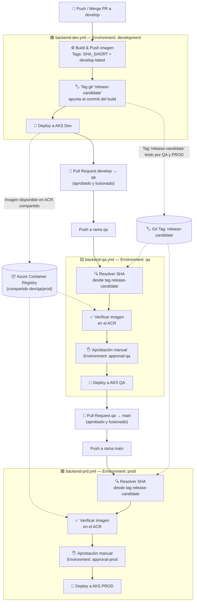

# README — Backend Solution Test Ventas

## 📌 Descripción General

Solution Test Ventas es una solución backend desarrollada con .NET 10, siguiendo principios de arquitectura limpia y buenas prácticas de desarrollo de APIs REST empresariales.
El proyecto implementa un sistema de gestión de empleados, departamentos, puestos de trabajo y categorías, incluyendo:
CRUDs completos

- Autenticación y autorización basada en roles
- Paginación
- Soft Delete
- Validaciones de negocio
- Infraestructura como código (IaC) con Terraform
- Estrategia GitFlow para control de versiones
- Preparación para despliegues CI/CD y ambientes separados
- La solución está orientada a escenarios reales empresariales y preparada para escalar en entornos cloud.


## 🚀 Tecnologías Utilizadas

Backend
-   .NET 10
-   ASP.NET Core Web API
-   Entity Framework Core
-   SQL Server
-   JWT Authentication
-   Swagger / OpenAPI
-   LINQ
-   Clean Architecture
-   Repository Pattern
-   Dependency Injection

Infraestructura / DevOps
-   Terraform
-   Azure SQL Server
-   Azure SQL Database
-   Azure Storage Account
-   GitFlow
-   GitHub
-   IaC Modular

Observabilidad / Monitoreo
-   OpenTelemetry (.NET)
-   OpenTelemetry Collector
-   Prometheus
-   Jaeger
-   Loki + Promtail
-   Grafana
-   Alertmanager
-   Serilog

## 🏗️ Arquitectura del Proyecto

La solución sigue una arquitectura desacoplada basada en capas:
```
API Layer
│
├── Controllers
├── DTOs
├── Middlewares
├── Filters
│
Application Layer
│
├── Services
├── Interfaces
├── Validators
│
Domain Layer
│
├── Entities
├── Enums
├── Business Rules
│
Infrastructure Layer
│
├── EF Core
├── Repositories
├── Persistence
├── Authentication
└── External Services
```

## 📂 Funcionalidades Implementadas

👥 Empleados 

- Obtener empleado por ID 
- Obtener empleado por Email
- Obtener empleado por Número de Documento 
- Búsquedas paginadas 
- Búsqueda por múltiples parámetros 
- Registro de empleados  
- Actualización de empleados
- Soft Delete 

🏢 Departamentos

- CRUD completo 
- Búsquedas por nombre 
- Búsquedas por ID
- Soft Delete 
- Seguridad basada en roles

💼 Puestos de Trabajo

- CRUD completo 
- Búsquedas por nombre 
- Búsquedas por ID 
- Soft Delete 
- Seguridad basada en roles

🗂️ Categorías

- CRUD de categorías 
- Soft Delete
- Validaciones de existencia 
- Manejo de respuestas estándar
- Seguridad basada en roles

🔐 Seguridad
La API implementa autenticación y autorización mediante JWT:
- Usuarios autenticados 
- Roles:
  - Administrator 
  - Customer 
  - Los endpoints sensibles requieren permisos específicos. 
  - Manejos de errores por permisos:
    - 401 Unauthorized 
    - 403 Forbidden

## 📑 Estándar de Respuesta

La API utiliza respuestas homogéneas:
```
{
  "data": {},
  "success": true,
  "message": "Operación exitosa",
  "errorMessage": null
}
```

Esto facilita:
- Integración frontend 
- Trazabilidad 
- Manejo uniforme de errores

## 🔎 Funcionalidades Técnicas Destacadas

✅ Soft Delete : Las eliminaciones son lógicas

```
status = false
```
Los registros permanecen en base de datos para auditoría e historial.

✅ Paginación : Implementación de paginación para búsquedas:

```
GET /api/Empleados?nombre=juan&Page=1&PageSize=50
```

✅ Validaciones de Negocio

- Validación de existencia de:
  - Puesto 
  - Departamento 
Antes de registrar empleados.

- Registro de ventas:
  - Se valida primero que el cliente tenga una cuenta.
  - Se valida que la cabecera del registro se haya registrad en la BD.
  - Se valida si los productos solicitados existen en la base de datos y hay sotck.
  - Se valida que el detalle se haya registrado en la BD con la misma cantidad de elementos solicitados.
  - Se reduce el stock de los productos adquiridos en la venta.

## 🌿 Estrategia GitFlow - Modelo de ramas (git branching)

**main**
- Código estable en producción 
- Un workflow de CI/CD para producción proviene de un merge/push en esta rama.
- Versionado

**develop**
- Rama de integración para desarrollo
- Un workflow de CI/CD para dev proviene de un merge/push en esta rama.
- Pull Request a `qa` cuando están listos los cambios.

**qa**
- Rama de integración para qa
- Un workflow de CI/CD para qa proviene de un merge/push en esta rama.
- Pull Request a `main` cuando están listos los cambios.
  
**feature/nombre**
- Nuevas funcionalidades 
- Nacen desde develop (git pull origin develop)
- Pull Request a `develop` cuando están listos los cambios.
  
**release/version**
- Cuando `develop` está listo para release.
- Preparación de releases 
- QA final 
- Correcciones menores

**hotfix/nombre**
- Correcciones urgentes en producción 
- Nacen desde main 
- Merge hacia:
    - main 
    - develop

## 🔄 CI/CD - Pipelines y Ambientes

La solución cuenta con **pipelines de CI/CD desacoplados por ambiente**, implementados con **GitHub Actions**, y orquestados a través de **GitHub Environments** (con sus respectivos secretos, variables y reglas de aprobación).

### 📌 Principios del diseño

- **Un único build, múltiples despliegues**: la imagen de la aplicación se construye **una sola vez** en el pipeline de `develop` y se **reutiliza** (promueve) hacia QA y PROD, evitando reconstruir el artefacto por ambiente.
- **Un único ACR compartido**: los tres pipelines (dev, qa, prd) usan el mismo Azure Container Registry para almacenar y consumir las imágenes.
- **Trazabilidad por SHA corto**: cada imagen se etiqueta con los primeros 7 dígitos del commit SHA (`SHA_SHORT`). Este tag es el identificador único del artefacto en todo su recorrido (dev → qa → prod).
- **Tag `release-candidate`**: al finalizar el build en `develop`, se crea/actualiza un tag de Git llamado `release-candidate` apuntando al commit exacto que originó la imagen. Los pipelines de QA y PROD leen este tag (en vez de `github.sha`, que correspondería al commit de merge) para recuperar el SHA correcto y localizar el artefacto en el ACR.
- **Promoción vía Pull Request**: el flujo entre ramas (`develop` → `qa` → `main`) se realiza mediante Pull Requests. Al aprobarse y fusionarse el PR, se dispara automáticamente el pipeline correspondiente a la rama destino.
- **Aprobación manual (Manual Approval / Required Reviewers)**: los despliegues a QA y PROD requieren aprobación manual mediante GitHub Environments protegidos (`approval-qa` y `approval-prod`), antes de continuar con el despliegue a AKS.
- **Verificación de artefacto**: antes de desplegar, QA y PROD verifican que la imagen con el SHA resuelto realmente exista en el ACR. Si no existe, el pipeline se detiene con error.

### 🧩 Pipelines y Environments de GitHub por ambiente

| Pipeline | Archivo | Trigger (rama) | Jobs principales | GitHub Environments usados |
|---|---|---|---|---|
| **CI/CD Dev** | `backend-dev.yml` | push a `develop` | Build & Push imagen → Tag `release-candidate` → Deploy a AKS Dev | `development` |
| **CD QA** | `backend-qa.yml` | push a `qa` | Resolver SHA candidato → Verificar imagen en ACR → Aprobación → Deploy a AKS QA | `qa`, `approval-qa` |
| **CD PROD** | `backend-prd.yml` | push a `main` | Resolver SHA candidato → Verificar imagen en ACR → Aprobación → Deploy a AKS PROD | `prod`, `approval-prod` |

### 🗺️ Diagrama de flujo CI/CD



### 🔐 Secretos y variables por Environment

Cada Environment de GitHub (`development`, `qa`, `approval-qa`, `prod`, `approval-prod`) gestiona de forma aislada:

- **Secrets**: `AZURE_CREDENTIALS`, `SUBSCRIPTION_ID`, `DB_CONNECTION_STRING`, `STORAGE_CONNECTION_STRING`, `JWT_SECRET`.
- **Variables**: `ENV`, `ACR_NAME`, `ACR_LOGIN_SERVER`, `AZURE_RESOURCE_GROUP`, `AKS_CLUSTER_NAME`.

Los environments `approval-qa` y `approval-prod` no ejecutan despliegue por sí mismos: actúan como **gate de aprobación manual** (Required Reviewers) que debe pasar antes de que el job de despliegue (`deploy-to-qa` / `deploy-to-prd`) pueda ejecutarse.

## 🔭 Observabilidad y Monitoreo

El backend incorpora un **stack de observabilidad self-hosted** (Opción B, alineado al laboratorio DMC *observabilidad-360*) que cubre los **3 pilares**: **métricas, trazas y logs**. Es la capa que permite ver, en tiempo real, cómo se comporta la API tanto en local como en AKS.

### 🧩 Stack

**OpenTelemetry** (instrumentación del API .NET) → **OTel Collector** → **Prometheus** (métricas) + **Jaeger** (trazas) + **Loki** (logs), con **Promtail** (recolección de logs desde stdout), **Grafana** (visualización), **Alertmanager** (alertas) y **Node Exporter** (métricas de infraestructura).

```
                               ┌──► Prometheus (métricas) ──► Alertmanager (alertas)
 API .NET ──OTLP──► OTel Collector ─┴──► Jaeger      (trazas)
 API .NET (stdout JSON) ──► Promtail ───► Loki        (logs)
                                    todo visualizado en Grafana
```

- **Métricas y trazas** salen del API por **OTLP** hacia el OTel Collector, que las reparte a **Prometheus** (remote-write) y **Jaeger**.
- **Logs**: el API escribe **JSON a `stdout`** con `trace_id`/`span_id`; **Promtail** los recoge y los envía a **Loki**. La correlación **log ↔ traza** se hace por `trace_id` (desde un log en Grafana se salta a su traza en Jaeger).

### 🧬 Instrumentación en el código

| Archivo | Rol |
|---|---|
| `src/ApiSolutionTestVentas.Api/Observability/ObservabilityExtensions.cs` | Configura OpenTelemetry: métricas (ASP.NET Core + HttpClient + Runtime) y trazas (ASP.NET Core + HttpClient + EF Core) → OTLP al Collector |
| `src/ApiSolutionTestVentas.Api/Observability/ActivityTraceEnricher.cs` | Inyecta `trace_id`/`span_id` en cada log para la correlación log ↔ traza |
| `Program.cs` | Registra la observabilidad (`AddObservability`) y configura Serilog para escribir JSON a stdout |

> La instrumentación **solo se activa** si existe la variable `OTEL_EXPORTER_OTLP_ENDPOINT`. Sin ella, el API corre normal pero **no exporta** telemetría (cero ruido).

### 📊 Dashboard — Golden Signals

Dashboard de Grafana **"API solution-test-ventas — Golden Signals (RED + Saturation)"**, organizado en las 4 señales de Google SRE:

| Señal | Paneles |
|---|---|
| 🟦 **Tráfico** | request rate total, por método HTTP, por ruta y llamadas salientes (HttpClient) |
| 🟥 **Errores** | % 5xx, % 4xx, requests por código de estado, excepciones .NET |
| 🟨 **Latencia** | p50 / p95 / p99, p95 por ruta |
| 🟩 **Saturación** | requests activas, memoria y CPU del proceso .NET, thread pool, CPU/RAM del host |

### 📁 Dónde vive y cómo levantarlo

| Entorno | Carpeta | Cómo |
|---|---|---|
| **Local** (Docker Compose) | `observability/` | `cd observability && docker compose up -d` — guía completa en [observability/README.md](observability/README.md) |
| **AKS** (Helm + manifests) | `k8s/observability/` | `cd k8s/observability && ./install.sh` (una sola vez por clúster) — guía en [k8s/observability/README.md](k8s/observability/README.md) |

Conectar el API a la observabilidad en **local** (añade las variables `OTEL_*` y lo une a la red del stack):
```
docker compose -f docker-compose.yaml -f docker-compose.observability.yml up -d --build
```

Acceder a **Grafana en AKS** (es un servicio interno del clúster, sin URL pública):
```
kubectl port-forward -n observability svc/kube-prometheus-stack-grafana 3000:80
# -> http://localhost:3000
```

> 📄 Informes con narrativa y capturas: [observability/INFORME-PROYECTO.html](observability/INFORME-PROYECTO.html) y [observability/INFORME-OBSERVABILIDAD-AKS.html](observability/INFORME-OBSERVABILIDAD-AKS.html). Notas de Azure/AKS en [observability/AZURE.md](observability/AZURE.md).

## 📘 Swagger

**En Local**
```
https://localhost:8080/swagger/index.html

```

**Desplegado a Nube**
```
https://endpoint_server:8080/swagger/index.html

```

## ⚙️ Configuración y ejecución en Local (sin docker)

**1. Clonar repositorio**
```
git clone <repo-url>
```

**2. Configurar appsettings.Development.json**
Esto solo para local, no para contenerizar.

```
"ConnectionStrings": {
"DefaultConnection": "Server=...;"
}
```

**3. Compilar la solución**
Ubicarse en la carpeta /src/ApiSolutionTestVentas.Api y ejecuta el siguiente comando

```
dotnet build

```

**4. Ejecutar migraciones**
Ubicarse en la carpeta /src/ApiSolutionTestVentas.Persistencia y ejecuta el siguiente comando

```
dotnet ef database update --startup-project /src/ApiSolutionTestVentas.Api
```

**5. Ejecutar la aplicación**
Ubìcarse en la raíz del proyecto (donde se encuentra el archivo docker-compose.yaml) ejecutar:
```
dotnet run
```

## 🐳 **Configuración y ejecución con Docker**

**1. Clonar repositorio**
```
git clone <repo-url>
```

**2. Compilar la solución**

Ubicarse en la carpeta /src/ApiSolutionTestVentas.Api y ejecuta el siguiente comando
```
dotnet build

```

**3. Ejecutar docker**

En la carpeta raiz del proyecto (donde se encuentra el archivo docker-compose.yaml) ejecutar:

```
docker compose -f docker-compose.yaml up -d  (sin observabilidad | telemetría)
docker compose -f docker-compose.yaml -f docker-compose.observability.yml up -d  (con observabilidad | telemetría)
```

**4. Validar endpoint - Swagger**
```
https://localhost:8080/swagger/index.html

```

